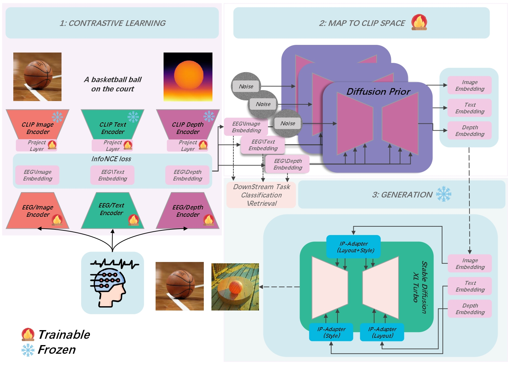
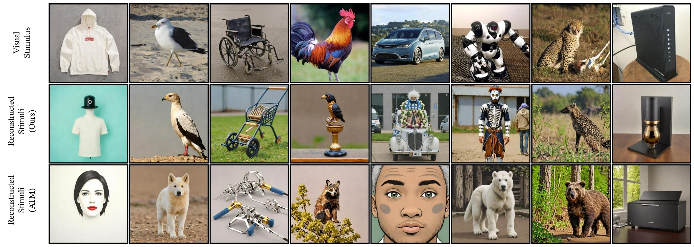

# CognitionCapturer
This is the official code repository for our AAAI 2025 paper: "CognitionCapturer: Decoding Visual Stimuli from Human EEG Signals with Multimodal Information."

<p align="center">
  <a href="#">
  <p align="center">
    <a href='https://arxiv.org/pdf/2412.10489'></a>
  </p>
</p>


  
 

## Code Structure (Only important files are annotated, refer to [lightning-hydra-template](https://github.com/ashleve/lightning-hydra-template) for instructions on other files)
```
File path | Description

/configs
┣ 📂 experiment
┃   ┗ 📜 brainencoder_all.yaml (Modify related parameters and use this YAML file to train the multi-modality model)
┃   ┗ 📜 brainencoder_single.yaml (Modify related parameters and use this YAML file to train the single-modality model)

┣ 📂 paths  
┃   ┗ 📜 pathsSelf.yaml (Modify directories to fit your own device)

/src
┣ 📂 data
┃   ┗ 📜 THINGSEEG_datamodule.py (Data loading related code)
┃   ┣ 📂 utils
┃   ┃   ┗ (Scripts for generating depth maps , text description and clip_embedding)

┣ 📂 models
┃   ┗ 📜 Cogcap_single_module.py 
┃   ┗ 📜 Cogcap_allmodality_module.py
┃   ┣ 📂 components
┃   ┃   ┗ (Model architecture, Loss, evaluation code)

┣ 📂 Scripts
┃   ┣ 📂 train_align
┃   ┃   ┗ (Code related to training Diffusion Prior)
┃   ┣ 📂 generation
┃   ┃   ┗ (Code related to image generation)

/others
```

## Environment setup
Install the required dependencies by running

```
conda env create -f environment.yaml
conda activate BCI
```
## Dataset, Model Weights
We used dataset follows the Data availability Section of [https://github.com/dongyangli-del/EEG_Image_decode](https://github.com/dongyangli-del/EEG_Image_decode). Please follow their README to download the EEG dataset, thanks to their prior work!

Our reconstruction results and the original images can be downloaded from this link: https://drive.google.com/file/d/1PfuXZo8JQ7SYsSsYpsUtswdq5gmWKLRU/view?usp=drive_link

Regarding pretrained models, we have used:
```
SDXL-Turbo：https://huggingface.co/stabilityai/sdxl-turbo
IP-Adapter：https://huggingface.co/h94/IP-Adapter
Open CLIP ViT-H/14：https://github.com/mlfoundations/open_clip
DepthAnything: https://github.com/LiheYoung/Depth-Anything
BLIP2: https://huggingface.co/docs/transformers/main/model_doc/blip-2
```


## Train and Test
Please first download the relevant weights and EEG datasets and change the paths in the code to the locations where you store the pretrained models before running the codes.

Before running scripts, please modify the related parameters in the code.

#### Classification
```
python src/train.py experiment=brainencoder_all.yaml
```
#### Diffusion Prior Align
```
python src/Scripts/train_align/main.py
```
#### Generation
```
python src/Scripts/generation/multiadapter/ip_adapter_testing.py
```

# TODO
- [ ] Update a more detailed README
- [ ] Submit model weights
- [ ] Organize the code for evaluating generated images

# Acknowledgements
#### 1. Our work is based on the following codes, thank you for your contributions!:

[https://github.com/dongyangli-del/EEG_Image_decode](https://github.com/dongyangli-del/EEG_Image_decode)

[lightning-hydra-template](https://github.com/ashleve/lightning-hydra-template)

[https://arxiv.org/pdf/2308.13234.pdf](https://github.com/eeyhsong/NICE-EEG)

#### 2. Original dataset code is available here:

https://www.sciencedirect.com/science/article/pii/S1053811922008758?via%3Dihub

Finally, thanks to Dr. Jili Xia for her help with this work.

# Citation

Hope this code is helpful. I would appreciate you citing us in your paper. 😊

```
@inproceedings{zhang2025cognitioncapturer,
  title={Cognitioncapturer: Decoding visual stimuli from human eeg signal with multimodal information},
  author={Zhang, Kaifan and He, Lihuo and Jiang, Xin and Lu, Wen and Wang, Di and Gao, Xinbo},
  booktitle={Proceedings of the AAAI Conference on Artificial Intelligence},
  volume={39},
  number={13},
  pages={14486--14493},
  year={2025}
}
```

# Contact
For any inquiries or further information, feel free to contact us at: zkaifan@163.com
